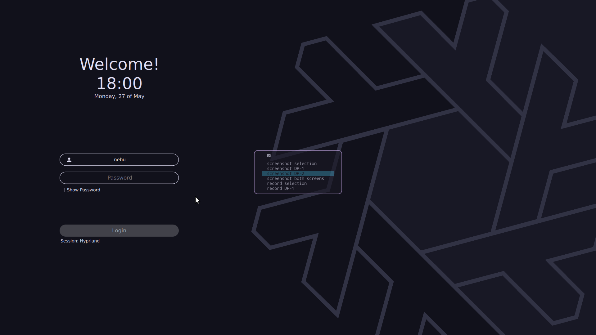

# nix-config

This is my personal flake for my nix-configs.

It is a work in progress.

## Previews

<details>
    <summary>sddm</summary>
    
</details>

## Hosts

### t5610

My desktop

### x230t

My laptop.

### nixISO

Minimal config for iso-installer.

Swaps caps and escape keys.

## Directory Structure

```txt
.
├── flake.lock
├── flake.nix
├── hosts
│   ├── nixISO
│   ├── t5610
│   └── x230t
├── modules
│   ├── homeManager
│   └── nixOS
├── README.md
└── secrets
    └── secrets.yaml
```

## Programs

| Category               | Programs                                                                       | Config                                                          |
| ---------------------- | ------------------------------------------------------------------------------ | --------------------------------------------------------------- |
| **Theme:**             | [rose-pine](https://rosepinetheme.com)                                         |                                                                 |
| **Shell:**             | [zsh](https://www.zsh.org)                                                     | [zsh/README.md](./modules/homeManager/zsh/README.md)            |
| **Display Manager:**   | [sddm-sugar-candy-nix](https://gitlab.com/Zhaith-Izaliel/sddm-sugar-candy-nix) | [sddm/README.md](./modules/nixOS/sddm/README.md)                |
| **Multiplexer:**       | [tmux](https://github.com/tmux/tmux)                                           | [tmux/README.md](./modules/homeManager/tmux/README.md)          |
| **Terminal:**          | [kitty](https://github.com/kovidgoyal/kitty)                                   | [kitty/README.md](./modules/homeManager/kitty/README.md)        |
| **Launcher:**          | [fuzzel](https://codeberg.org/dnkl/fuzzel)                                     | [fuzzel/README.md](./modules/homeManager/fuzzel/README.md)      |
| **Browser:**           | [firefox](https://firefox-source-docs.mozilla.org/contributing/index.html)     | [firefox/README.md](./modules/homeManager/firefox/README.md)    |
| **Video Player:**      | [mpv](https://mpv.io/)                                                         | [mpv/README.md](./modules/homeManager/mpv/README.md)            |
| **Pdf Viewer:**        | [sioyek](https://sioyek.info)                                                  | [sioyek/README.md](./modules/homeManager/sioyek/README.md)      |
|                        | [xournalpp](https://github.com/xournalpp/xournalpp)                            | [xournalpp/README.md](.modules/homeManager/xournalpp/README.md) |
| **WM:**                | [hyprland](https://github.com/hyprwm/Hyprland)                                 | [hyprland/README.md](./modules/homeManager/hyprland/README.md)  |
| **Status Bar:**        | [waybar](https://github.com/Alexays/Waybar)                                    | [waybar/README.md](./modules/homeManager/waybar/README.md)      |
| **Secrets provision:** | [sops-nix](https://github.com/Mic92/sops-nix)                                  | [withSecrets/README.md](./modules/nixOS/withSecrets/README.md)  |

## TODO

- [ ] start using some deployment tool like morph
- [ ] switch from waybar to ags
- [ ] add some images to README.md

## Special Thanks

All the helpful people on the [**Nix/NixOs(unofficial)**](https://discord.gg/JQTUJdmG) discord server.
